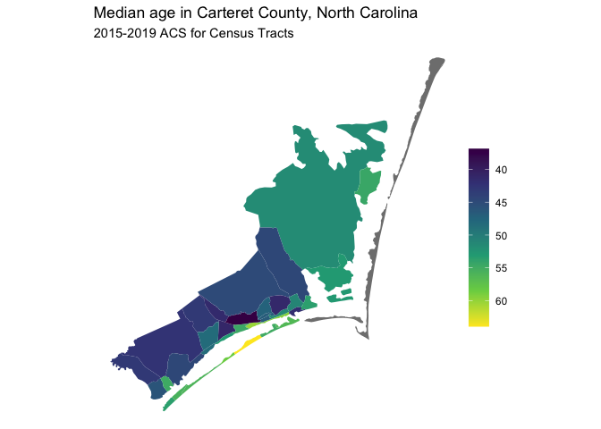
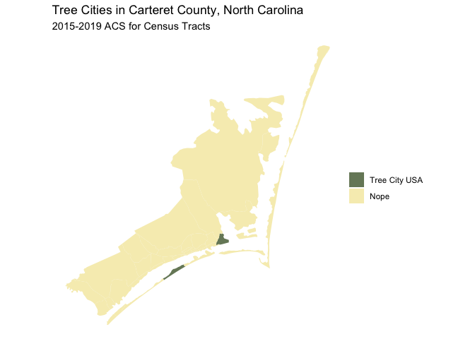

<!-- README.md is generated from README.Rmd. Please edit that file -->

# Choosing colors for your chart

<!-- badges: start -->
<!-- badges: end -->

Some R code I used to generate two charts of median age and [Tree City
USA](https://www.arborday.org/programs/treecityusa/) for the Carteret
County, NC. These figures were used in my
[talk](https://slides.com/trang1618/ims-viz/) at the Institute of Marine
Sciences at UNC Chapel Hill.

Additional scratch R scripts can be ignored.

## Load in packages

Shout out to Kyle Walker for his work on the **{tidycensus}** R package.
This package makes it extremely easy to download census data (in just a
few lines like below). Kyle also just preprinted his book [*Analyzing US
Census Data: Methods, Maps, and Models in
R*](https://walker-data.com/census-r/). See an overview of the book
content
[here](https://twitter.com/kyle_e_walker/status/1432357038772957189).

``` r
library(tidycensus)
library(tidyverse)
```

If you would like to choose a different variable (of over 20,000
variables), you can use `load_variables()` and browse the resulting
dataframe.

``` r
# v17 <- load_variables(2017, "acs5", cache = TRUE)
# View(v17)
```

## Continuous example: Age

We use the sequential color palette *viridis* for this:

``` r
carteret_age_df <- get_acs(
  state = "NC", county = "Carteret", geography = "tract",
  variables = "B01002_001", geometry = TRUE
) 
#> Getting data from the 2015-2019 5-year ACS
#> Downloading feature geometry from the Census website.  To cache shapefiles for use in future sessions, set `options(tigris_use_cache = TRUE)`.
#>   |                                                                              |                                                                      |   0%  |                                                                              |=                                                                     |   1%  |                                                                              |=                                                                     |   2%  |                                                                              |==                                                                    |   2%  |                                                                              |==                                                                    |   3%  |                                                                              |===                                                                   |   4%  |                                                                              |===                                                                   |   5%  |                                                                              |====                                                                  |   5%  |                                                                              |====                                                                  |   6%  |                                                                              |=====                                                                 |   7%  |                                                                              |=====                                                                 |   8%  |                                                                              |======                                                                |   8%  |                                                                              |======                                                                |   9%  |                                                                              |=======                                                               |   9%  |                                                                              |=======                                                               |  10%  |                                                                              |=======                                                               |  11%  |                                                                              |========                                                              |  11%  |                                                                              |========                                                              |  12%  |                                                                              |=========                                                             |  13%  |                                                                              |==========                                                            |  14%  |                                                                              |==========                                                            |  15%  |                                                                              |===========                                                           |  15%  |                                                                              |===========                                                           |  16%  |                                                                              |============                                                          |  17%  |                                                                              |============                                                          |  18%  |                                                                              |=============                                                         |  18%  |                                                                              |=============                                                         |  19%  |                                                                              |==============                                                        |  20%  |                                                                              |===============                                                       |  21%  |                                                                              |===============                                                       |  22%  |                                                                              |================                                                      |  23%  |                                                                              |=================                                                     |  24%  |                                                                              |==================                                                    |  26%  |                                                                              |===================                                                   |  27%  |                                                                              |===================                                                   |  28%  |                                                                              |====================                                                  |  29%  |                                                                              |=====================                                                 |  30%  |                                                                              |======================                                                |  31%  |                                                                              |======================                                                |  32%  |                                                                              |=======================                                               |  32%  |                                                                              |=======================                                               |  33%  |                                                                              |========================                                              |  35%  |                                                                              |=========================                                             |  36%  |                                                                              |==========================                                            |  37%  |                                                                              |===========================                                           |  38%  |                                                                              |===========================                                           |  39%  |                                                                              |============================                                          |  40%  |                                                                              |============================                                          |  41%  |                                                                              |=============================                                         |  41%  |                                                                              |==============================                                        |  42%  |                                                                              |==============================                                        |  43%  |                                                                              |===============================                                       |  44%  |                                                                              |================================                                      |  45%  |                                                                              |=================================                                     |  48%  |                                                                              |==================================                                    |  49%  |                                                                              |===================================                                   |  49%  |                                                                              |===================================                                   |  50%  |                                                                              |====================================                                  |  51%  |                                                                              |=====================================                                 |  53%  |                                                                              |======================================                                |  54%  |                                                                              |======================================                                |  55%  |                                                                              |=======================================                               |  56%  |                                                                              |========================================                              |  56%  |                                                                              |=========================================                             |  58%  |                                                                              |=========================================                             |  59%  |                                                                              |==========================================                            |  60%  |                                                                              |===========================================                           |  61%  |                                                                              |===========================================                           |  62%  |                                                                              |============================================                          |  63%  |                                                                              |=============================================                         |  64%  |                                                                              |=============================================                         |  65%  |                                                                              |==============================================                        |  65%  |                                                                              |===============================================                       |  67%  |                                                                              |===============================================                       |  68%  |                                                                              |================================================                      |  68%  |                                                                              |================================================                      |  69%  |                                                                              |=================================================                     |  70%  |                                                                              |==================================================                    |  71%  |                                                                              |==================================================                    |  72%  |                                                                              |===================================================                   |  73%  |                                                                              |===================================================                   |  74%  |                                                                              |====================================================                  |  74%  |                                                                              |=====================================================                 |  75%  |                                                                              |=====================================================                 |  76%  |                                                                              |======================================================                |  77%  |                                                                              |=======================================================               |  79%  |                                                                              |========================================================              |  80%  |                                                                              |========================================================              |  81%  |                                                                              |=========================================================             |  81%  |                                                                              |==========================================================            |  82%  |                                                                              |==========================================================            |  83%  |                                                                              |===========================================================           |  84%  |                                                                              |===========================================================           |  85%  |                                                                              |============================================================          |  85%  |                                                                              |============================================================          |  86%  |                                                                              |=============================================================         |  87%  |                                                                              |==============================================================        |  88%  |                                                                              |==============================================================        |  89%  |                                                                              |===============================================================       |  89%  |                                                                              |===============================================================       |  90%  |                                                                              |================================================================      |  91%  |                                                                              |================================================================      |  92%  |                                                                              |=================================================================     |  92%  |                                                                              |=================================================================     |  93%  |                                                                              |==================================================================    |  94%  |                                                                              |==================================================================    |  95%  |                                                                              |===================================================================   |  96%  |                                                                              |====================================================================  |  96%  |                                                                              |====================================================================  |  97%  |                                                                              |===================================================================== |  99%  |                                                                              |======================================================================| 100%

carteret_age <- carteret_age_df %>%
  ggplot(aes(fill = estimate)) +
  geom_sf(color = NA) +
  coord_sf(crs = 26911) +
  scale_fill_viridis_c(
    option = "D",
    direction = -1,
    trans = "reverse"
  ) +
  labs(
    title = "Median age in Carteret County, North Carolina",
    subtitle = "2015-2019 ACS for Census Tracts",
    fill = NULL
  ) +
  theme_void() +
  theme(legend.key.height = unit(30, "pt"))

carteret_age
```

<!-- -->

## Categorical example: Tree City USA

The census actually doesn’t have this data. I had to browse the [Tree
City USA participants
map](https://www.ncforestservice.gov/Urban/tcusa_NC_Participants.asp) to
see which cities/census tract that participated.

``` r
carteret_tree_df <- carteret_age_df %>%
  mutate(tree = if_else(grepl("9710.02|9703.04", NAME), "Tree City USA", "Nope"))

carteret_tree <- carteret_tree_df %>%
  ggplot(aes(fill = fct_rev(tree))) +
  geom_sf(color = NA) +
  coord_sf(crs = 26911) +
  scale_fill_manual(values = c("#778868", "#f6edbd")) +
  labs(
    title = "Tree Cities in Carteret County, North Carolina",
    subtitle = "2015-2019 ACS for Census Tracts",
    fill = NULL
  ) +
  theme_void()

carteret_tree
```

<!-- -->

## Save charts

These last two lines are not run in this README, but I wanted to point
out that specifying height and width would allow you to control the
relative size of text vs. graph.

``` r
# ggsave("figs/carteret_age.png", carteret_age, height = 4, width = 4.5)
# ggsave("figs/carteret-tree.png", carteret_tree, height = 4, width = 5)
```
